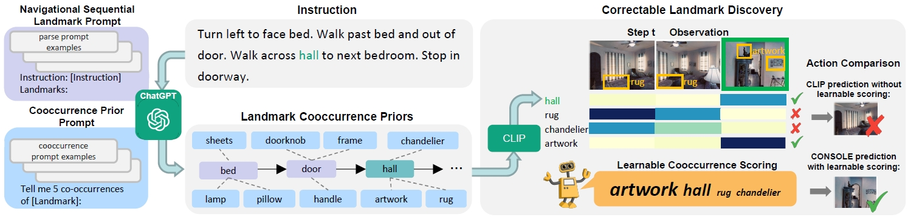

# Correctable Landmark Discovery via Large Models for Vision-Language Navigation

#### 介绍
联合中山大学、达闼共同研发的机器人导航算法，基于mindspore实现的测试代码。视觉语言导航(VLN)要求智能体按照语言指令到达目标位置。成功导航的一个关键因素是将指令中隐含的地标与不同的视觉观察结合起来。然而，以前的VLN智能体无法执行准确的模态对齐，特别是在未探索的场景中，因为它们从有限的导航数据中学习，缺乏足够的开放世界对齐知识。在这项工作中，我们提出了一种新的VLN范式，称为通过大模型可校正地标发现(CONSOLE)。在CONSOLE中，我们通过引入一种新的基于ChatGPT和CLIP两个大模型的可校正地标发现方案，将VLN转换为开放世界顺序地标发现问题。具体而言，我们使用ChatGPT提供丰富的开放世界地标共现常识，并基于这些常识先验进行CLIP驱动的地标发现。为了减轻由于缺乏视觉约束而导致的噪声，我们引入了一个可学习的共现评分模块，该模块根据实际观察纠正每个共现的重要性，以准确发现地标。我们进一步设计了一种观察增强策略，将我们的框架与不同的VLN代理优雅地结合起来，其中我们利用校正的地标特征来获得增强的观察特征，以用于行动决策。在多个流行的VLN基准(R2R, REVERIE, R4R, RxR)上进行的大量实验结果表明，CONSOLE比强基线具有显着的优势。特别是，我们的CONSOLE在不可见的场景中建立了R2R和R4R的最新SOTA结果。



[//]: # (#### 软件架构)

[//]: # (软件架构说明)

## 准备工作
#### 安装环境

1. 安装mindspore (python=3.9,cuda=11.6)
```
conda create -n mindspore_console_py39 python=3.9 -y
conda activate mindspore_console_py39
pip install https://ms-release.obs.cn-north-4.myhuaweicloud.com/2.3.0rc2/MindSpore/unified/x86_64/mindspore-2.3.0rc2-cp39-cp39-linux_x86_64.whl --trusted-host ms-release.obs.cn-north-4.myhuaweicloud.com -i https://pypi.tuna.tsinghua.edu.cn/simple
```

2. 安装导航模型所需环境
```
pip install -r requirements.txt

# install mindformers
git clone -b r1.1.0 https://gitee.com/mindspore/mindformers.git
cd mindformers
bash build.sh

# install mindnlp
pip install mindnlp==0.3.2

# install timm
git clone https://github.com/rwightman/pytorch-image-models.git
cd pytorch-image-models
git checkout 9cc7dda6e5fcbbc7ac5ba5d2d44050d2a8e3e38d
```

3. 安装导航模拟器：根据 [here](https://github.com/peteanderson80/Matterport3DSimulator) 的指引安装Matterport3D模拟器

#### 数据准备
1. 下载特征，连接图，训练后的模型 [here](https://github.com/cshizhe/VLN-HAMT)
2. 下载包含地标和共现的注释文件 [here](https://drive.google.com/drive/folders/15ofyBXUHrqklos7e6Gptn5fXleVjS7Hg?usp=sharing)

## 导航
### VLN 测试

```setup
cd finetune_src
bash scripts/run_r2r_mindspore.sh
```

## 引用
如果我们的工作可以帮助到您，请考虑引用：
```setup
@article{lin2024correctable,
  title={Correctable Landmark Discovery Via Large Models for Vision-Language Navigation},
  author={Lin, Bingqian and Nie, Yunshuang and Wei, Ziming and Zhu, Yi and Xu, Hang and Ma, Shikui and Liu, Jianzhuang and Liang, Xiaodan},
  journal={IEEE Transactions on Pattern Analysis and Machine Intelligence},
  year={2024},
  publisher={IEEE}
}
```


[//]: # (#### 参与贡献)

[//]: # ()
[//]: # (1.  Fork 本仓库)

[//]: # (2.  新建 Feat_xxx 分支)

[//]: # (3.  提交代码)

[//]: # (4.  新建 Pull Request)

[//]: # ()
[//]: # (#### 特技)

[//]: # ()
[//]: # (1.  使用 Readme\_XXX.md 来支持不同的语言，例如 Readme\_en.md, Readme\_zh.md)

[//]: # (2.  Gitee 官方博客 [blog.gitee.com]&#40;https://blog.gitee.com&#41;)

[//]: # (3.  你可以 [https://gitee.com/explore]&#40;https://gitee.com/explore&#41; 这个地址来了解 Gitee 上的优秀开源项目)

[//]: # (4.  [GVP]&#40;https://gitee.com/gvp&#41; 全称是 Gitee 最有价值开源项目，是综合评定出的优秀开源项目)

[//]: # (5.  Gitee 官方提供的使用手册 [https://gitee.com/help]&#40;https://gitee.com/help&#41;)

[//]: # (6.  Gitee 封面人物是一档用来展示 Gitee 会员风采的栏目 [https://gitee.com/gitee-stars/]&#40;https://gitee.com/gitee-stars/&#41;)
